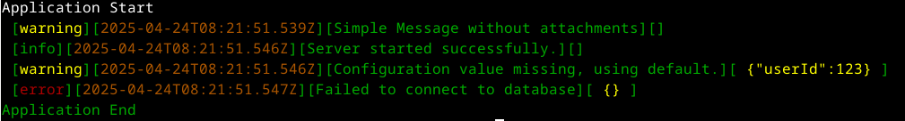

# FifoLogger

A simple, asynchronous, FIFO (First-In, First-Out) logger for Node.js and TypeScript applications. Designed to handle high log volumes efficiently without blocking the main event loop, especially when writing to files.

## Features

*   **Asynchronous Logging:** Writes logs without blocking your application's execution flow.
*   **FIFO Queue:** Buffers log messages in a queue, handling backpressure gracefully when writing to slow destinations (like files).
*   **Multiple Destinations:** Log to standard output (`STDOUT`) or a specified file (`FILE`).
*   **Configurable Log Levels:** Set a minimum log level (`DEBUG`, `INFO`, `WARNING`, `ERROR`, `CRITICAL`) to control verbosity.
*   **Flexible Formatting:**
    *   Plain text format.
    *   Colored text format for improved readability in terminals.
    *   Structured JSON format for easy parsing by log management systems.
*   **Optional Log Prefix:** Add a custom prefix (e.g., application name) to every log message.
*   **Message Truncation:** Automatically truncate messages exceeding a configured maximum length.
*   **Configurable File Writing Speed:** Adjust the dequeue timeout (`DequeueTimeoutMs`) when writing to files to balance performance and resource usage.
*   **Robust File Error Handling:** Includes a retry mechanism with backoff for transient file stream errors.
*   **Simple Static API:** Easy to integrate and use throughout your application.

## Installation

Once it will be published on npm and/or yarn :

```bash
npm install fifologger # Or your chosen package name on npm
# or
yarn add fifologger
```

## Usage
See the /examples directory in the repository for more detailed usage scenarios.
The run.sh bash script will be useful to launch the examples.

### Basic Example (logging to console)

```bash
import { FifoLogger, LogLevel } from 'fifoLogger'; // Adjust path as needed

const testAttachedObj1 = { userId: 123 }
console.log("Application Start");

// Log messages
FifoLogger.log(LogLevel.WARNING, "2 - Simple Message without attachments")

FifoLogger.info("Server started successfully.");
FifoLogger.debug("not visible, default log level is INFO");
FifoLogger.warn("Configuration value missing, using default.", testAttachedObj1);
FifoLogger.error("Failed to connect to database", new Error("Connection timeout"));

// No need to call close() explicitly for STDOUT unless coordinating shutdown
console.log("Application End");
```
which will lead to this output:<br>


### Logging to file

```bash
import { FifoLogger, FifoLoggerConfig, LogDestination, LogLevel } from 'fifoLogger'; // Adjust path as needed

console.log("Application Start");

// Configuration for logging to a file
const config: FifoLoggerConfig = {
  logPrefix: "YourAppName",
  minLogLevel: LogLevel.INFO,
  destination: LogDestination.FILE,
  fileName: "/tmp/yourappname.log", // Specify the log file path
  jsonMode: true // Log in JSON format
};

// Initialize the logger
FifoLogger.init(config);

// Log messages
FifoLogger.info("Processing started for file", { filename: "data.csv" });
// ... log more messages ...
FifoLogger.error("Error processing record", { recordId: 45, error: "Invalid format" });

// IMPORTANT: Close the logger to ensure all buffered logs are written to the file
console.log("Processing finished, closing logger...");
FifoLogger.close(() => {
  console.log("Logger closed. Exiting.");
  process.exit(0);
});
```
which will lead to this output:<br>


## Configuration Options
The FifoLogger.init() method accepts a configuration object (FifoLoggerConfig) with the following options:

- **logPrefix** *(string, optional)*: A string prepended to every log message. Default: ''.
- **minLogLevel** *(LogLevel, optional)*: The minimum level of messages to log. Options: LogLevel.DEBUG, LogLevel.INFO, LogLevel.WARNING, LogLevel.ERROR, LogLevel.CRITICAL. Default: LogLevel.INFO.
- **maxEventLength** *(number, optional)*: Maximum length of a formatted log message. Longer messages will be truncated with .... Set to 0 for no truncation. Default: 0.
- **destination** *(LogDestination, optional)*: Where to send logs. Options: LogDestination.STDOUT, LogDestination.FILE. Default: LogDestination.STDOUT (implicitly, if fileName is not provided).
- **useColor** *(boolean, optional)*: Enable/disable colored output (only affects non-JSON terminal output). Default: true.
- **jsonMode** *(boolean, optional)*: Output logs in JSON format. Default: false.
- **fileName** *(string, optional)*: The full path to the log file. Required if destination is LogDestination.FILE.
- **dequeueTimeoutMs** *(DequeueTimeoutMs, optional)*: The interval (in milliseconds) at which the logger attempts to write queued messages to the file. Options: DequeueTimeoutMs.STANDARD (100), DequeueTimeoutMs.EASY (250), DequeueTimeoutMs.MEDIUM (500), DequeueTimeoutMs.SLOW (1000). Default: DequeueTimeoutMs.STANDARD.

## API Reference
FifoLogger provides a static API:

- **init(config: FifoLoggerConfig)**: Initializes the logger with the given configuration. Should be called once at application startup. If not called, the default configuration will be used (log to stdout, colored, no json format).
- **log(level: LogLevel, message: string, ...optionalParams: any[])**: Logs a message with the specified level and optional structured data.
- **debug(message: string, ...optionalParams: any[])**: Shortcut for log(LogLevel.DEBUG, ...).
- **info(message: string, ...optionalParams: any[])**: Shortcut for log(LogLevel.INFO, ...).
- **warn(message: string, ...optionalParams: any[])**: Shortcut for log(LogLevel.WARNING, ...).
- **error(message: string, ...optionalParams: any[])**: Shortcut for log(LogLevel.ERROR, ...).
- **critical(message: string, ...optionalParams: any[])**: Shortcut for log(LogLevel.CRITICAL, ...).
- **close(callback?: () => void)**: Initiates graceful shutdown. Flushes the log queue (especially important for file logging) and closes the file stream. The optional callback is executed when the closing process is complete. Crucial to call before exiting applications that log to files.

## Examples
See the /examples directory in the repository for more detailed usage scenarios:

- **simple-stdout.ts**: Basic console logging.
- **simple-file.ts**: simple file json logging.
- **file1000.ts**: Logging many messages quickly to a file.
- **stdout1000.ts**: Logging many messages quickly to the console.
- **slowFile1000.ts**: Demonstrates using a slower dequeue timeout.
- **bigFile100.ts**: Shows logging with large attached objects.

## Contributing
Contributions are welcome! Please feel free to submit issues or pull requests.

## License
MIT License

